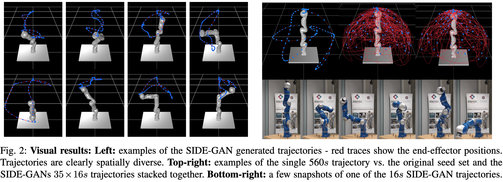
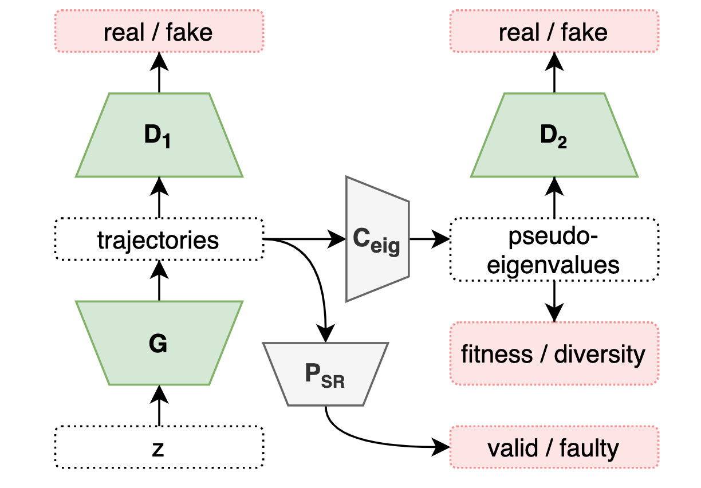

### SIDE-GAN-Pytorch code for adversarial generation of dynamic system ID trajectories.

This is the accompanying code for the paper 'Adversarial Generation of Informative Trajectories for Dynamics System Identification', published in IEEE iROS2020.
It is capable of fast generation of multiple cyclic dynamic system identification trajectories, like in the figure below:


The architecture belongs to the class of generative adversarial networks (GANs) and can be summarised as follows:



**If you would like a short video-explanation please follow this link: https://youtu.be/N32WzBEAIFM**

### Credit:

If you intend to use any of this for a publication please cite 
> _"Adversarial Generation of Informative Trajectories for Dynamics System Identification," M. Jegorova, J. Smith, M. Mistry and T. Hospedales, 2020 IEEE/RSJ International Conference on Intelligent Robots and Systems (IROS)._
https://arxiv.org/pdf/2003.01190.pdf


### Robot, simulator, training data, and other code-specific details:
Prerequisites to run this code are as follows:
```  
    python >=3.5.3  
    pytorch >= 1.3.0  
    numpy >= 1.13.3  
    os
    time
```


We provide a small training dataset for an example here, however, as it is a subsample of the training data used for the aforementioned publication the results are unlikely to be the same. If for whatever reason you require the full dataset, please contact m.jegorova@ed.ac.uk - I will be happy to provide this data.

Please note that the trajectories provided are for KUKA LWR IV manipulation platforms. The generation procedure is likely to generalise to other platforms, but you will have to acquire the training trajectories parameters elsewhere (in our case we used modified Fourier transform parameters, as described in the paper). 

The pre-trained parts of the network - i.e., success rate (no self-collision) predictor and eigenvalue converted are provided with the code, pretrained on a larger original dataset. In case if the training data/robot platform changes drastically these would have to be pretrained from scratch as explained in the paper.

For visualising these trajectories you would need to use [ARDL library](https://github.com/smithjoshua001/ARDL), please make sure you use the correct mark of a manipulator.

### To run the code
First, **please unpack the archived training data**, then run

<code> python3 SIDE-GAN_fit_div_SR.py --dataset fresh_folder --dataroot ./data_for_pytorch_small </code>

The outputs to expect:
* the generated system ID trajectory parameters per training epoch (initialised with 10 different noise vectors) in `.npy' format
* correcponding generated pseudo-eigenvalues for each of these trajectories 
* the trained network parameters per epoch.
Currently the number of training epochs is set to 50, but that is easily changed:

```
  
usage: DCGAN_pytorch_double_best_fit_div_SR.py [-h] --dataset DATASET
                                               --dataroot DATAROOT
                                               [--trajectf TRAJECTF]
                                               [--workers WORKERS]
                                               [--batchSize BATCHSIZE]
                                               [--imageSize IMAGESIZE]
                                               [--nz NZ] [--ngf NGF]
                                               [--ndf NDF] [--niter NITER]
                                               [--genreps GENREPS] [--lr LR]
                                               [--beta1 BETA1] [--cuda]
                                               [--ngpu NGPU] [--netG NETG]
                                               [--netD NETD] [--outf OUTF]
                                               [--manualSeed MANUALSEED]
                                               [--classes CLASSES]

optional arguments:
  -h, --help            show this help message and exit
  --dataset DATASET     cifar10 | lsun | mnist |imagenet | folder | lfw | fake
                        | fresh_folder
  --dataroot DATAROOT   path to dataset
  --trajectf TRAJECTF   path to generated trajectories per training step
  --workers WORKERS     number of data loading workers
  --batchSize BATCHSIZE
                        input batch size
  --imageSize IMAGESIZE
                        the height / width of the input image to network
  --nz NZ               size of the latent z vector
  --ngf NGF
  --ndf NDF
  --niter NITER         number of epochs to train for
  --genreps GENREPS     number of additional generator training iterations per
                        cycle
  --lr LR               learning rate, default=0.0002
  --beta1 BETA1         beta1 for adam. default=0.5
  --cuda                enables cuda
  --ngpu NGPU           number of GPUs to use
  --netG NETG           path to netG (to continue training)
  --netD NETD           path to netD (to continue training)
  --outf OUTF           folder to output images and model checkpoints
  --manualSeed MANUALSEED
                        manual seed
  --classes CLASSES     comma separated list of classes for the lsun data set
```

